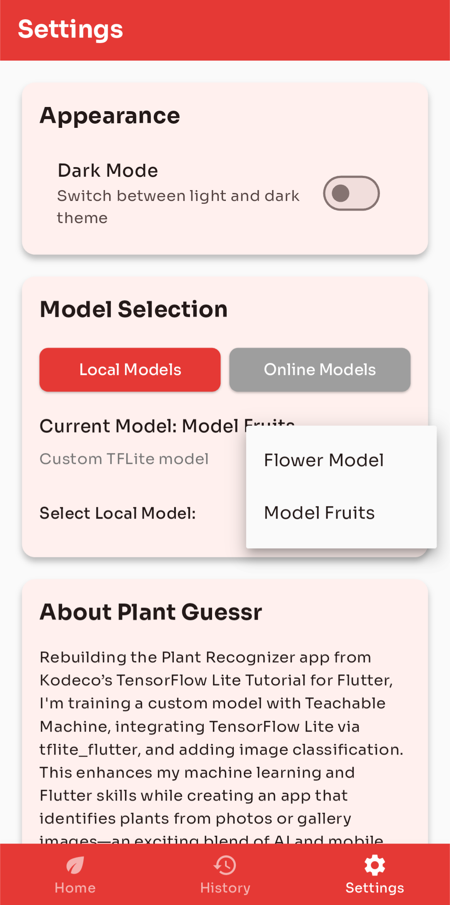
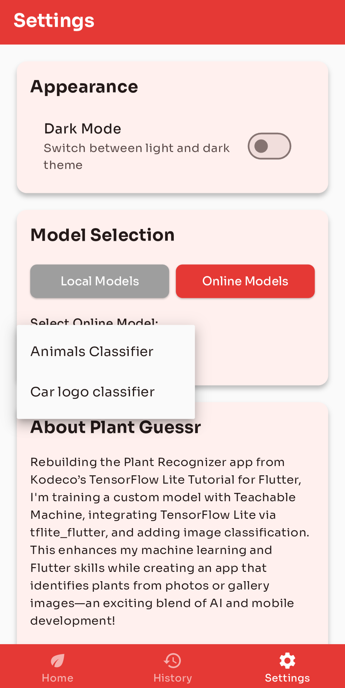

# Flower API - A plant recognition app on HuggingFace

Aux débuts du projet, l'idée était d'adapter le tutoriel de [Dickson Neoh](https://dicksonneoh.com/portfolio/bringing_high_quality_image_models_to_mobile/#-hugging-face-x-timm) afin de permettre un traitement d'image par AI en ligne grâce à HuggingFace.

Ce projet constitue la dernière version à jour.

## Table of Contents

- [Flower API - A plant recognition app on HuggingFace](#flower-api---a-plant-recognition-app-on-huggingface)
  * [Table of Contents](#table-of-contents)
  * [Les débuts](#les-d-buts)
  * [Le code](#le-code)
    + [Model Provider](#model-provider)
    + [Home Screen](#home-screen)
  * [Les horaires](#les-horaires)

## Les débuts

Nous avions alors aux débuts une application codé par S. Cruz-Lara qui permet d'envoyer une image codé en base64 à une API gradio hébergé par HuggingFace afin d'effectuer un traitement par IA et recevoir une réponse et l'afficher dans l'application.

J'ai alors pris pas mal de temps à chercher une API qui fonctionne sous Gradio hébergé par HuggingFace qui permet de prendre une image en entrée et envoyer du texte en sortie. J'ai alors énormément utilisé la base de S. Cruz-Lara afin de tester les différentes API que je trouvais au fur et à mesure.

Pour autant, je ne comptais pas partir sur cette base pour l'affichage, j'ai donc repris l'affichage du [premier projet de développement mobile](https://github.com/IUTNancyCharlemagne/plant-recogniser-min-Eylexander).

## Le code

Ainsi, par rapport à la premier application, il n'y a eu que quelques changements.

### Model Provider

J'ai alors adapté le code de mon provider de modèle afin d'accepter des modèles HuggingFace qui sont caractérisés par leur URL. J'ai donc initialisé un mode en ligne ou hors ligne afin d'effectuer le bon type d'analyse en fonction du modèle choisi dans les paramètres. Ainsi, la page des paramètres a été légèrement modifiée.

|  |  |
| ------------------------------------------------------------ | ------------------------------------------------------------ |

### Home Screen

Ainsi, le code permettant de lancer l'analyse a été modifié afin de prendre en compte soit une analyse hors ligne ou en ligne. J'ai alors utilisé les HistoryEntry afin de rassembler toutes les données diverses dans un seul objet.

## Les horaires

Beaucoup d'heures ont été investis en dehors des heures de cours.

- HuggingFace : 6 Heures
- Model Provider : 2 Heures
- Analyse par type : 2 Heures
